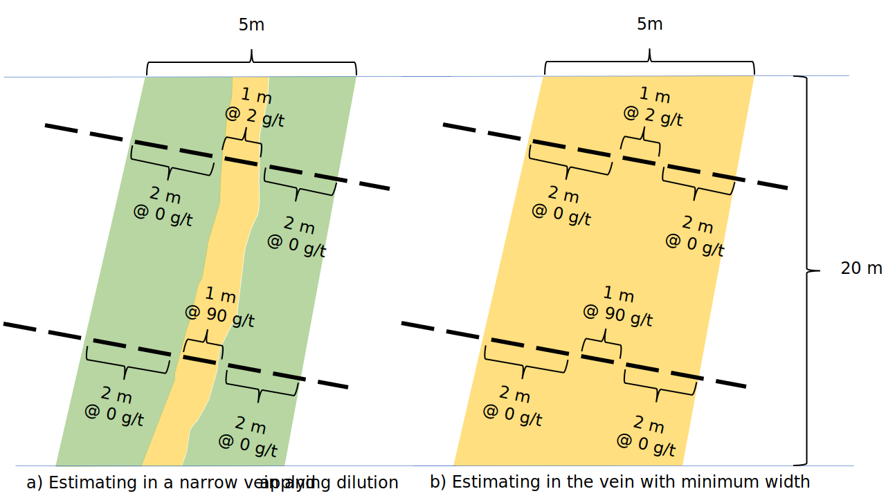

# Geostat note. About using minimum width for vein modelling.

Minimum width is a modelling parameter or constraint that is usually applied at the time of modelling narrow veins. The most common reason for using a minimum width is to ensure the average grade interpolated is similar to the grade of mining stopes. However, the same results are obtained by adding dilution or mineable shapes optimized (MSO).

Let's review an example. Fig. 1. a) shows an interpolation in a narrow vein of 1m thickness and 4m dilution to meet a minimum of 5m mining width. Fig. 1. b) shows the same narrow vein interpolated after applying a minimum width of 5m. The average grade of vein and waste over 20 m is approximately 9.2 g/t in both cases. The vein modelled with minimum width this is `(8m*0g/t + 1m*2g/t + 1m*90g/t)/10m = 9.2g/t`. The 1m vein itself (Fig. 1. a)) is `(2 g/t + 90 g/t)/2= 46 g/t`, but there are 4m of waste at zero grade added as dilution, so the average grade is `(1m*46g/t + 4m*0g/t)/5m = 9.2g/t`.

|  |
|:--:|
| <i> Fig. 1 -  a) Narrow vein with dilution skin applied, and b) narrow vein modelled with minimum width. Drillhole and sample composites are shown as dashed black lines. </i>|

In most cases, interpolating narrow veins without minimum width is preferred, especially if the vein contacts are well defined by visual inspection, grade, or other criteria. And this is why:
 1) The vein and the waste have different geostatistical distributions. Each one has higher grade continuity than both of them combined. Waste and vein distributions also have different means, variances, and spatial continuity, so the two combined may not be stationary and can be nonlinear. Combining the two statistical populations will produce variograms with very poor continuity. It will also make the mineralization appear with a higher nugget effect and higher coefficient of variation. The results of interpolations with linear techniques such as ordinary kriging and the inverse of the power of the distance will be sensitive to minor changes in interpolation parameters. They will also suffer from severe over-smoothing (underestimating high grades and overestimating low grades). 
 2) If the number of waste samples is large (like in fig 1), then the proportion of samples mineralized is low (low probability of higher grade samples). Therefore, many decisions based on sample distribution (histogram and CDF) will likely be wrong. For example, the 90 g/t composite may be considered an outlier and harshly capped. Likewise, techniques based on CDF, such as normal score transformation, normal score variogram back transformation, global change of support, and conditional simulations, will be unreliable. 
 3) Modelling with minimum width will limit the ability of mining engineers to test different mining scenarios such as narrower stopes, preferential dilution to a specific side of the vein, or the implementation of more selective mining techniques.

Deciding between modelling narrow veins vs broader domains with minimum width applied is not that obvious when the contacts of the mineralized domain are not well defined. In this scenario, if veins are modelled based on "economic" cutoff grades and the grade of the vein is not continuous, the risk of overstating the grade of the narrow veins is high.  
